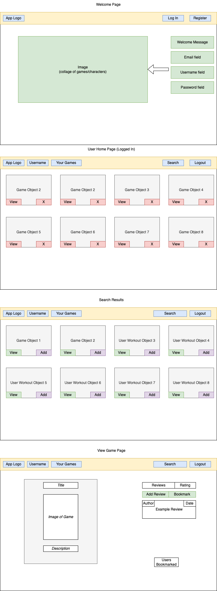
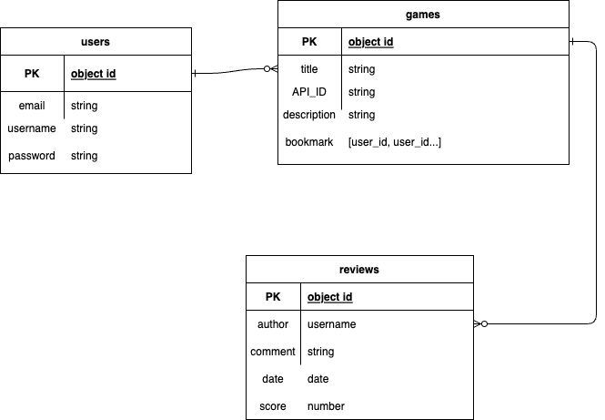

# Player-api

# Team assignments

### Back-End 
Bryan

### Full Stack
Abdiaziz

## Technologies used
Backend:
- Mongoose
- Axios
- Node/ Express
Frontend:
- React
- Bootstrap

## Overview
An app that allows users to search for video games, leave reviews and ratings and also bookmark them to a library. 

## User Stories
Users should be able to:
- Sign up
- Login
- Change Password
- Search for games
- Leave reviews for games
- Update reviews
- Delete reviews
- Leave ratings for video games
- Bookmark games to library
- See others users library
- See all games bookmarked in user homepage
- See reviews for games

## Wireframes

## ERD

